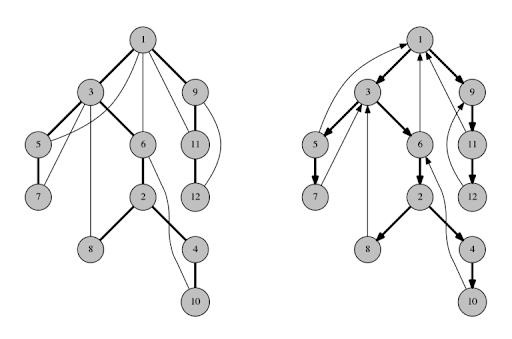

# Звіт до проєкту


### Зміст
**[Вступ](#Вступ)**<br>
**[Читання графу з файлу](#читання-графу-з-файлу)**<br>
**[Запис графу в файл](#запис-графу-в-файл)**<br>
**[Пошук компонент зв’язності](#пошук-компонент-зв'язності)**<br>
**[Пошук компонент сильної зв’язності](#пошук-компонент-сильної-зв'язності)**<br>
**[Пошук точок сполучення](#пошук-точок-сполучення)**<br>
**[Пошук мостів](#пошук-мостів)**<br>
**[Висновоки](#пошук-мостів)**<br>

---

## Вступ
Вступ тут

## Читання графу з файлу
Описана у файлі [func_read_write.py](https://github.com/gingrwho/discreteProject_17/blob/main/func_read_write.py)
```python
def read_graph(path: str) -> list
```
Парсить csv файл в список кортежів.<br>
Вигляд списку:
```
[(NUMBER OF NODES, NUMBER OF EDGES), (node1, node2), (node1, node3), (node2, node4)]
```
* Перший кортеж в масиві - це кількість вершин і ребер в ньому, оскільки саме такого формату csv файли нам даються.<br>

## Запис графу в файл
Описана у файлі [func_read_write.py](https://github.com/gingrwho/discreteProject_17/blob/main/func_read_write.py)
```python
def write_graph(path: str, graph: list) -> None
```
Аналогічно до попередньої функції, записує список кортежів в csv файл.

## Пошук компонент зв'язності
Описана у файлі [func_connected_components.py](https://github.com/gingrwho/discreteProject_17/blob/main/func_connected_components.py)
```python
def connected_components(graph: list) -> list
```
Знаходить компоненти зв'язаності в неорієнтованому графі.<br>

Для розв'язання цього завдання було розроблено дві допоміжні функції .
+ Перша перетворює список ребер графа в словник, який репрезентує матрицю суміжності. Тобто ключем є кожна вершина, а значенням – множина суміжних їй вершин.  Складність такого алгоритму, з огляду на те, що використовуються множини, як алементи словника, Складає O(m), де m- кількість ребер графа.
```python
def create_adj_matrix(graph: list) -> dict
```
+ Друга функція знаходить усі вершини в графі, до яких існує шлях з певної заданої вершини. Для цього у функції є стек та множина всіх відвіданих вершин. 
```python
def dfs(graph: dict, start: int) -> set
```
<br>Алгоритм працює допоки стек не стане порожнім.
1. Зі стеку береться останній елемент, і одразу ж видаляється звідти, це значення присвоюється поточній вершині. 
2. Далі відбувається перевірка, чи ця поточна вершина ще не була відвідана(чи її немає у множині відвіданих вершин). 
3. Якщо уже відвідана, то беремо таким самим способом наступну вершину з кінця стеку,
4. Якщо ж ні, то додаємо усіх сусідів цієї вершини у стек
5. Після цього додаємо цю вершину в множину відвіданих вершин
6. Переходимо до кроку 1.

Сама функція знаходження компонентів зв'язаності виглядає отак:
```python
# create adjacency matrix from list of edges
matrix_graph = create_adj_matrix(graph)
# create set of nodes that have not been added to any connected component
nodesleft = set(matrix_graph.keys())
# initialise empty list of connected components
components = []

# run till left nodes that have not been assigned a connected component
while nodesleft:
    # find connected component in the graph
    con_component = dfs(matrix_graph, nodesleft.pop())
    # remove all nodes that are in a component from nodesleft
    nodesleft.difference_update(con_component)
    # add connected component to list of connected components
    components.append(list(con_component))

return components
```

## Пошук компонент сильної зв’язності
Описана у файлі [func_strongly_connected.py](https://github.com/gingrwho/discreteProject_17/blob/main/func_strongly_connected.py)
```python
def find_SCC(graph: list)
```
Знаходить компоненти сильної зв'язаності в орієнтованому графі.<br>
Функція повертає список з списків, де кожен елемент (список), це множина вершин одного компонента зв'язаності орієнотованого графу. <br><br>
Для знаходження результату було використано алгоритм Тар’яна. Він працює з часовою складністю `O(n + m)`, де n - кількість вершин, m - кількість ребер.

Було використано дві допоміжні функції:
1. Перша перетворює список ребер **орієнтованого** графа в словник, який репрезентує матрицю суміжності. Тобто ключем є кожна вершина, а значенням – множина суміжних їй вершин.
```python
def create_dadj_matrix(graph: list) -> dict
```
2. Друга - це реалізація DFS, модифікована для алгоритму Тар'яна
```python
def dfs(at: int)
```

Алгоритм полягає у тому, щоб після запуску DFS  на будь якісь якійсь стартовій вершині, запускати його на всіх точках її сусідів, тобто рухаючись від “кореня до листя”. Після відвідування вершина додається до стеку, і видаляється звідти після закінчення її опрацювання. <br><br>
Ми індексуємо та зберігаємо всі індекси вершин у спеціальному масиві. Існує також масив low, який відстежує вершину з найменшим номером у прямому порядку обходу, досяжну з кожного вузла через послідовність прямих зв’язків, за якими слідує один висхідний зв’язок.<br><br>
Скориставшись тим, що за допомогою DFS можна розглядати вершини в зворотньому порядку, тобто від останньої до першої, ми можемо для кожної вершини обчислити  максимальну точку, досяжну через попередника.<br><br>
 

## Пошук точок сполучення
Описана у файлі [func_cut_vertices](https://github.com/gingrwho/discreteProject_17/blob/main/func_cut_vertices.py)
```python
def cut_vertices(graph: list)
```
Повертає список всіх точок сполучення в графі.<br>

Було використано допоміжну функцію що перетворює список ребер графа в словник, який репрезентує матрицю суміжності. Тобто ключем є кожна вершина, а значенням – множина суміжних їй вершин.  Складність такого алгоритму, з огляду на те, що використовуються множини, як алементи словника, Складає O(m), де m- кількість ребер графа.
```python
def create_adj_matrix(graph: list) -> dict
```
<br>
Очевидний варіант розв’язку задачі: по черзі прибирати кожну вершину і дивитися, чи зміниться кількість компонент графа. Працює з часовою складність `О(n^2)` де n - кількість вершин. Це не ефективно і не працюватиме на великих наборах даних.<br><br>
Існує більш ефективний алгоритм, який дозволяє знаходити точки сполучення за `О(n)`. Цей алгоритм полягає в тому, щоб запустити обхід дерева вглиб, під час якого ми перевіряємо певні властивості вершин. Розглянемо рисунок.

 


